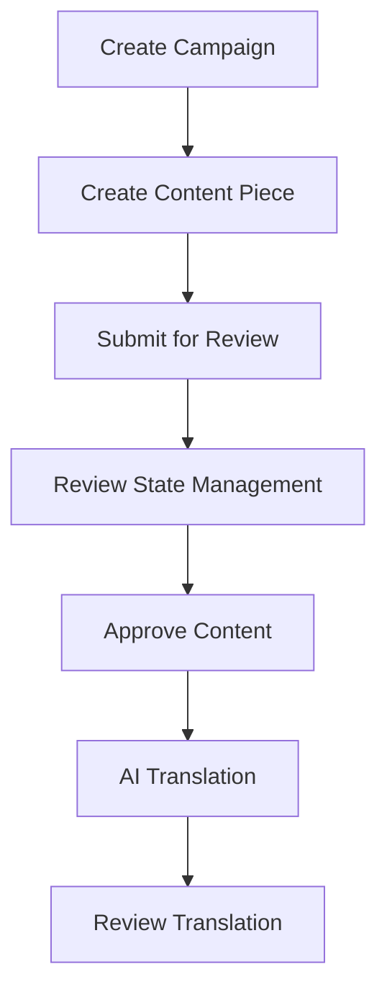

# Complete Workflow Examples - Campaign to Translation

This guide provides step-by-step Postman examples for the complete AI content workflow from campaign creation to AI translation.

## 🎯 Workflow Overview



## 📋 Prerequisites

- **Base URL**: `http://localhost:3001`
- **Content-Type**: `application/json`
- **Database**: PostgreSQL running with proper migrations

---

## Step 1: Create Campaign

Create a new marketing campaign that will contain your content pieces.

### **POST** `/api/campaigns`

```json
{
  "name": "Summer 2024 Global Product Launch",
  "description": "Comprehensive international campaign for our new summer product line targeting multiple markets",
  "status": "draft",
  "targetMarkets": ["US", "ES", "DE", "FR", "IT"],
  "tags": ["product-launch", "summer", "international", "social-media", "blog"],
  "createdBy": "campaign-manager@company.com"
}
```

### **Expected Response:**

```json
{
  "success": true,
  "data": {
    "id": "f47ac10b-58cc-4372-a567-0e02b2c3d479",
    "name": "Summer 2024 Global Product Launch",
    "description": "Comprehensive international campaign for our new summer product line targeting multiple markets",
    "status": "draft",
    "targetMarkets": ["US", "ES", "DE", "FR", "IT"],
    "tags": ["product-launch", "summer", "international", "social-media", "blog"],
    "createdBy": "campaign-manager@company.com",
    "createdAt": "2024-07-15T10:30:00.000Z",
    "updatedAt": "2024-07-15T10:30:00.000Z"
  },
  "message": "Campaign created successfully"
}
```

**📝 Save the `campaignId` for next steps:** `f47ac10b-58cc-4372-a567-0e02b2c3d479`

---

## Step 2: Create Content Piece

Create the original content piece that will serve as the source for translations.

### **POST** `/api/content`

```json
{
  "campaignId": "f47ac10b-58cc-4372-a567-0e02b2c3d479",
  "title": "Summer Fashion Trends 2024: The Ultimate Guide for Professionals",
  "description": "A comprehensive guide showcasing the versatility and elegance of our summer collection, specifically designed for young professionals who want to look stylish while maintaining workplace appropriateness",
  "contentType": "blog_post",
  "sourceLanguage": "en",
  "targetLanguage": "en",
  "priority": "high",
  "originalPrompt": "Write a comprehensive blog post about summer fashion trends for young professionals, focusing on versatile pieces that work for both work and weekend, emphasizing our new summer collection",
  "contentMetadata": {
    "seoKeywords": ["summer fashion", "professional attire", "workplace style", "versatile clothing", "summer trends 2024"],
    "targetAudience": "young professionals aged 25-35",
    "estimatedWordCount": 1500,
    "industry": "fashion",
    "contentGoal": "product promotion and brand awareness"
  },
  "finalText": "Summer is here, and with it comes the perfect opportunity to refresh your professional wardrobe with pieces that seamlessly transition from boardroom to happy hour. Our 2024 summer collection embodies the perfect balance of sophistication and comfort, offering young professionals the versatility they crave in today's dynamic work environment.\n\nThe key to mastering summer professional style lies in choosing pieces that are both breathable and polished. Lightweight blazers in linen blends provide structure without the bulk, while our signature moisture-wicking dress shirts ensure you stay cool during those intense afternoon meetings. For women, our midi dresses in wrinkle-resistant fabrics offer elegance that travels well from office presentations to client dinners.\n\nColor psychology plays a crucial role in professional summer dressing. While traditional navy and black remain staples, this season we're embracing sophisticated shades like sage green, warm terracotta, and classic cream. These colors project confidence while remaining appropriately conservative for professional settings.\n\nAccessorizing for summer requires a strategic approach. Lightweight scarves can add personality to basic outfits while serving the practical purpose of balancing aggressive air conditioning. Our curated selection of professional-grade sandals and loafers ensures comfort during long commutes while maintaining the polished appearance your career demands.\n\nLayering remains essential even in summer months. A lightweight cardigan or structured vest can instantly transform a casual summer dress into boardroom-appropriate attire. Our innovative fabric technologies ensure these pieces pack small for travel while maintaining their professional appearance throughout the day.\n\nThe modern professional needs clothing that works as hard as they do. Our summer collection addresses real-world challenges: fabrics that don't wrinkle during commutes, colors that hide coffee stains, and silhouettes that look equally appropriate in video calls and in-person meetings.\n\nInvestment pieces for summer should focus on versatility and quality. A well-tailored summer-weight suit can serve multiple functions, while classic white and light blue shirts provide the foundation for countless professional looks. Our collection emphasizes timeless pieces that transcend seasonal trends while incorporating contemporary details that keep your look current.\n\nSustainability and professional style now go hand in hand. Our summer collection features responsibly sourced materials and timeless designs that won't look dated next season. This approach not only benefits the environment but also provides excellent value for the cost-conscious professional.\n\nAs we navigate the evolving landscape of professional dress codes, summer presents unique opportunities to express personal style while maintaining workplace appropriateness. Our collection provides the tools you need to craft a professional image that's both authentic and authoritative, ensuring you're always appropriately dressed for success.",
  "createdBy": "content-creator@company.com"
}
```

### **Expected Response:**

```json
{
  "success": true,
  "data": {
    "id": "b8d4c5e2-1a3f-4e9d-8c7b-9f2e5a8d4c3b",
    "campaignId": "f47ac10b-58cc-4372-a567-0e02b2c3d479",
    "title": "Summer Fashion Trends 2024: The Ultimate Guide for Professionals",
    "description": "A comprehensive guide showcasing the versatility and elegance of our summer collection...",
    "contentType": "blog_post",
    "reviewState": "draft",
    "sourceLanguage": "en",
    "targetLanguage": "en",
    "priority": "high",
    "translationOf": null,
    "finalText": "Summer is here, and with it comes the perfect opportunity...",
    "contentMetadata": {
      "seoKeywords": ["summer fashion", "professional attire", "workplace style"],
      "targetAudience": "young professionals aged 25-35"
    },
    "createdAt": "2024-07-15T11:00:00.000Z",
    "updatedAt": "2024-07-15T11:00:00.000Z"
  },
  "message": "Content piece created successfully"
}
```

**📝 Save the `contentId` for next steps:** `b8d4c5e2-1a3f-4e9d-8c7b-9f2e5a8d4c3b`

---

## Step 3: Submit Content for Review

Submit the content piece for editorial review before translation.

### **POST** `/api/content/{contentId}/submit-for-review`

**URL:** `/api/content/b8d4c5e2-1a3f-4e9d-8c7b-9f2e5a8d4c3b/submit-for-review`

```json
{
  "reviewerIds": ["editor@company.com", "translation-coordinator@company.com"],
  "priority": "high",
  "comments": "Please review this content for translation readiness. Focus on international market adaptation and cultural sensitivity. This will be translated to Spanish, German, French, and Italian markets."
}
```

### **Expected Response:**

```json
{
  "success": true,
  "data": {
    "id": "b8d4c5e2-1a3f-4e9d-8c7b-9f2e5a8d4c3b",
    "reviewState": "pending_review",
    "updatedAt": "2024-07-15T11:15:00.000Z"
  },
  "message": "Content submitted for review successfully"
}
```

---

## Step 4: Review State Management

Update the review state as content goes through the review process.

### **PATCH** `/api/content/{contentId}/review-state`

**URL:** `/api/content/b8d4c5e2-1a3f-4e9d-8c7b-9f2e5a8d4c3b/review-state`

```json
{
  "newState": "reviewed",
  "reviewType": "content_review",
  "action": "approve",
  "comments": "Content is excellent and ready for translation. The language is clear, culturally neutral, and professional. SEO keywords are well-integrated. Approved for all target markets.",
  "suggestions": "Consider adding a brief cultural note for the German market regarding formal business attire expectations.",
  "reviewerId": "editor@company.com",
  "reviewerName": "Sarah Johnson",
  "reviewerRole": "Senior Content Editor"
}
```

### **Expected Response:**

```json
{
  "success": true,
  "data": {
    "id": "b8d4c5e2-1a3f-4e9d-8c7b-9f2e5a8d4c3b",
    "reviewState": "reviewed",
    "updatedAt": "2024-07-15T11:30:00.000Z"
  },
  "message": "Review state updated to reviewed"
}
```

---

## Step 5: Approve Content for Translation

Give final approval to make the content ready for AI translation.

### **POST** `/api/content/{contentId}/approve`

**URL:** `/api/content/b8d4c5e2-1a3f-4e9d-8c7b-9f2e5a8d4c3b/approve`

```json
{
  "reviewerId": "translation-manager@company.com",
  "reviewerName": "Maria Garcia",
  "comments": "Content approved for international translation. All target markets have been considered. Ready for AI translation to Spanish, German, French, and Italian.",
  "publishImmediately": false
}
```

### **Expected Response:**

```json
{
  "success": true,
  "data": {
    "id": "b8d4c5e2-1a3f-4e9d-8c7b-9f2e5a8d4c3b",
    "reviewState": "approved",
    "updatedAt": "2024-07-15T11:45:00.000Z"
  },
  "message": "Content approved for translation. Ready for international markets."
}
```

---

## Step 6: AI Translation - Spanish Market

Now translate the approved content to Spanish using AI.

### **POST** `/api/content/{contentId}/translate`

**URL:** `/api/content/b8d4c5e2-1a3f-4e9d-8c7b-9f2e5a8d4c3b/translate`

```json
{
  "sourceLanguage": "en",
  "targetLanguage": "es",
  "translationType": "localized",
  "context": "Professional fashion content for Spanish market. Target audience is young professionals aged 25-35. Maintain professional tone while adapting to Spanish business culture. Consider both Spain and Latin American markets.",
  "model": "claude",
  "userId": "translator@company.com"
}
```

### **Expected Response:**

```json
{
  "success": true,
  "data": {
    "originalContent": {
      "id": "b8d4c5e2-1a3f-4e9d-8c7b-9f2e5a8d4c3b",
      "title": "Summer Fashion Trends 2024: The Ultimate Guide for Professionals",
      "reviewState": "approved",
      "contentType": "blog_post"
    },
    "translatedContent": {
      "id": "d2f5a8b1-4c7e-4f8a-9b2d-5e8f1a4b7c9e",
      "campaignId": "f47ac10b-58cc-4372-a567-0e02b2c3d479",
      "title": "Tendencias de Moda Verano 2024: La Guía Definitiva para Profesionales",
      "description": "Una guía completa que muestra la versatilidad y elegancia de nuestra colección de verano, específicamente diseñada para jóvenes profesionales que quieren lucir elegantes manteniendo la apropiada apariencia laboral",
      "contentType": "blog_post",
      "sourceLanguage": "en",
      "targetLanguage": "es",
      "translationOf": "b8d4c5e2-1a3f-4e9d-8c7b-9f2e5a8d4c3b",
      "reviewState": "draft",
      "finalText": "El verano ha llegado, y con él la oportunidad perfecta de renovar tu guardarropa profesional con piezas que se adaptan sin problemas desde la sala de juntas hasta el aperitivo después del trabajo...",
      "contentMetadata": {
        "translationQuality": 0.92,
        "aiModel": "claude",
        "translationType": "localized",
        "culturalNotes": "Adaptado para el mercado hispanohablante con terminología empresarial apropiada y consideraciones culturales para tanto España como Latinoamérica",
        "translationStrategy": "Enfoque localizado con adaptación cultural y terminología específica del mercado. Se utilizó un registro profesional apropiado manteniendo la naturalidad del español",
        "confidenceScore": 0.89
      }
    },
    "translationResult": {
      "qualityScore": 0.92,
      "culturalNotes": "Adaptado para el mercado hispanohablante con terminología empresarial apropiada y consideraciones culturales para tanto España como Latinoamérica. Se ajustó el registro formal manteniendo cercanía profesional.",
      "translationStrategy": "Enfoque localizado con adaptación cultural y terminología específica del mercado. Se utilizó un registro profesional apropiado manteniendo la naturalidad del español. Las referencias culturales se adaptaron al contexto empresarial hispano.",
      "confidenceScore": 0.89,
      "aiDraft": {
        "id": "c8f1d4b7-2e5a-4f9c-8d2b-6e9a2d5f8c1b",
        "modelUsed": "claude",
        "generationType": "translation",
        "qualityScore": 0.92,
        "responseTimeMs": 4500,
        "tokenCount": 2847,
        "costUsd": 0.0234
      }
    },
    "translationMetadata": {
      "sourceLanguage": "en",
      "targetLanguage": "es",
      "model": "claude",
      "translationType": "localized"
    }
  },
  "message": "Content translated to es successfully"
}
```

**📝 Save the Spanish `translatedContentId`:** `d2f5a8b1-4c7e-4f8a-9b2d-5e8f1a4b7c9e`

---

## Step 7: Additional Translations - German Market

Translate the same content to German for the German market.

### **POST** `/api/content/{contentId}/translate`

**URL:** `/api/content/b8d4c5e2-1a3f-4e9d-8c7b-9f2e5a8d4c3b/translate`

```json
{
  "sourceLanguage": "en",
  "targetLanguage": "de",
  "translationType": "culturally_adapted",
  "context": "Professional fashion content for German market. German business culture values precision, quality, and conservative professional appearance. Target audience is young professionals who appreciate engineering quality and attention to detail.",
  "model": "claude",
  "userId": "translator@company.com"
}
```

### **Expected Response:**

```json
{
  "success": true,
  "data": {
    "originalContent": {
      "id": "b8d4c5e2-1a3f-4e9d-8c7b-9f2e5a8d4c3b",
      "title": "Summer Fashion Trends 2024: The Ultimate Guide for Professionals"
    },
    "translatedContent": {
      "id": "a9e2d5f8-3b6c-4a7d-9f1e-2c5b8d4a7f0c",
      "title": "Sommermode-Trends 2024: Der ultimative Leitfaden für Berufstätige",
      "targetLanguage": "de",
      "translationOf": "b8d4c5e2-1a3f-4e9d-8c7b-9f2e5a8d4c3b",
      "contentMetadata": {
        "translationQuality": 0.94,
        "culturalNotes": "Angepasst für den deutschen Markt mit Fokus auf Qualität, Präzision und konservative Professionalität. Verwendung von Sie-Form für formelle Geschäftskommunikation."
      }
    },
    "translationResult": {
      "qualityScore": 0.94,
      "translationStrategy": "Kulturell angepasster Ansatz mit deutschspezifischer Geschäftsterminologie und Betonung von Qualität und Langlebigkeit"
    }
  },
  "message": "Content translated to de successfully"
}
```

---

## Step 8: Review Translation Quality

Review the Spanish translation for final approval.

### **PATCH** `/api/content/{translatedContentId}/review-state`

**URL:** `/api/content/d2f5a8b1-4c7e-4f8a-9b2d-5e8f1a4b7c9e/review-state`

```json
{
  "newState": "pending_review",
  "reviewType": "translation_review",
  "action": "approve",
  "comments": "Translation quality is excellent. The Spanish version maintains the professional tone while feeling natural to native speakers. Cultural adaptations are appropriate for both Spain and Latin American markets.",
  "suggestions": "Consider adding specific size conversion charts for Spanish market in the final published version.",
  "reviewerId": "spanish-editor@company.com",
  "reviewerName": "Carlos Rodriguez",
  "reviewerRole": "Spanish Translation Editor"
}
```

---

## Step 9: Final Translation Approval

Approve the Spanish translation for publication.

### **POST** `/api/content/{translatedContentId}/approve`

**URL:** `/api/content/d2f5a8b1-4c7e-4f8a-9b2d-5e8f1a4b7c9e/approve`

```json
{
  "reviewerId": "spanish-market-manager@company.com",
  "reviewerName": "Isabella Martinez",
  "comments": "Spanish translation approved for publication. Content is ready for Spanish-speaking markets. Quality score of 0.92 indicates excellent translation. Ready for marketing campaigns.",
  "publishImmediately": true
}
```

---

## Step 10: Verify Campaign Status

Check the campaign to see all content pieces and translations.

### **GET** `/api/campaigns/{campaignId}`

**URL:** `/api/campaigns/f47ac10b-58cc-4372-a567-0e02b2c3d479`

### **Expected Response:**

```json
{
  "success": true,
  "data": {
    "id": "f47ac10b-58cc-4372-a567-0e02b2c3d479",
    "name": "Summer 2024 Global Product Launch",
    "targetMarkets": ["US", "ES", "DE", "FR", "IT"],
    "contentPieces": [
      {
        "id": "b8d4c5e2-1a3f-4e9d-8c7b-9f2e5a8d4c3b",
        "title": "Summer Fashion Trends 2024: The Ultimate Guide for Professionals",
        "targetLanguage": "en",
        "reviewState": "approved",
        "translationOf": null
      },
      {
        "id": "d2f5a8b1-4c7e-4f8a-9b2d-5e8f1a4b7c9e",
        "title": "Tendencias de Moda Verano 2024: La Guía Definitiva para Profesionales",
        "targetLanguage": "es",
        "reviewState": "approved",
        "translationOf": "b8d4c5e2-1a3f-4e9d-8c7b-9f2e5a8d4c3b"
      },
      {
        "id": "a9e2d5f8-3b6c-4a7d-9f1e-2c5b8d4a7f0c",
        "title": "Sommermode-Trends 2024: Der ultimative Leitfaden für Berufstätige",
        "targetLanguage": "de",
        "reviewState": "draft",
        "translationOf": "b8d4c5e2-1a3f-4e9d-8c7b-9f2e5a8d4c3b"
      }
    ]
  }
}
```

---

## 📊 Campaign Statistics

Check campaign performance and translation metrics.

### **GET** `/api/campaigns/{campaignId}/stats`

**URL:** `/api/campaigns/f47ac10b-58cc-4372-a567-0e02b2c3d479/stats`

### **Expected Response:**

```json
{
  "success": true,
  "data": {
    "totalContentPieces": 3,
    "contentByState": {
      "approved": 2,
      "draft": 1
    },
    "totalAIDrafts": 2,
    "totalReviews": 4,
    "avgResponseTime": 4250,
    "completionRate": 66.67,
    "translationMetrics": {
      "totalTranslations": 2,
      "avgQualityScore": 0.93,
      "languagesCovered": ["es", "de"],
      "pendingTranslations": ["fr", "it"]
    }
  }
}
```

---

## 🛠️ Postman Collection Setup

### Environment Variables
Create a Postman environment with these variables:

```json
{
  "baseUrl": "http://localhost:3001",
  "campaignId": "{{campaignId}}",
  "contentId": "{{contentId}}",
  "spanishContentId": "{{spanishContentId}}",
  "germanContentId": "{{germanContentId}}"
}
```

### Collection Structure

```
📁 AI Content Workflow
├── 📁 1. Campaign Management
│   ├── Create Campaign
│   ├── Get Campaign
│   └── Campaign Stats
├── 📁 2. Content Creation
│   ├── Create Content Piece
│   ├── Get Content Piece
│   └── Update Content Piece
├── 📁 3. Review Workflow
│   ├── Submit for Review
│   ├── Update Review State
│   ├── Approve Content
│   └── Reject Content
├── 📁 4. AI Translation
│   ├── Translate to Spanish
│   ├── Translate to German
│   ├── Translate to French
│   └── Translate to Italian
└── 📁 5. Translation Review
    ├── Review Translation
    └── Approve Translation
```

## 🔍 Testing Tips

1. **Sequential Execution**: Run requests in order as each step depends on the previous
2. **Save IDs**: Use Postman tests to automatically save IDs to environment variables
3. **Validate Responses**: Check response status codes and save important data
4. **Monitor Translation Quality**: Pay attention to quality scores and cultural notes
5. **Test Different Markets**: Try various language combinations and translation types

## 📈 Success Metrics

- **Campaign Created**: Status 201
- **Content Approved**: reviewState = "approved"
- **Translation Quality**: qualityScore > 0.8
- **Cultural Adaptation**: culturalNotes present and relevant
- **Workflow Completion**: Original → Translated → Approved

This complete workflow demonstrates the full AI content translation pipeline from campaign creation to multi-language publication!